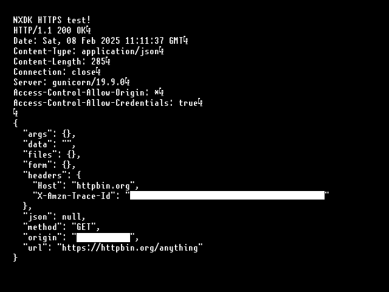

# NXDK-HTTPS-Example
An example of performing an HTTPS GET request (https://httpbin.org/anything) on the original Xbox using the NXDK.

## Build instructions
See [.github/workflows/build.yml](.github/workflows/build.yml)

## Special thanks to:
 - [thrimbor](https://github.com/thrimbor/) for his NXDK port of MbedTLS and for providing me with some glue code needed to get up and running.
 - [Ryzee119](https://github.com/Ryzee119/) who's [build.yml](https://github.com/Ryzee119/LithiumX/blob/7462aa2ced67f7f0bb61b82eed3b1479bbc61b41/.github/workflows/build.yml) I copied.
